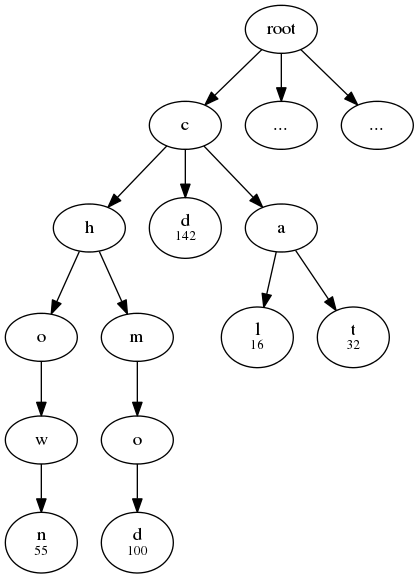

# Spell checker

Simple spell correction and word prediction using a trie structure.

Algorithm
=========

Word completion is accomplished by using what is called a
trie, that is an organization of words using the letters as the nodes of
a tree, which by following the one way edges one recovers the words1.
Tries provide a simple yet effective way to do word completion by
storing how many times each word is used in the tree itself, thus
allowing for a prediction of the incomplete input based on the user
history. To illustrate the main idea lets think of an example, imagine
we have a word history input of these commands.

    chmod  = 100
    chown  = 55
    cd     = 142
    cat    = 32
    cal    = 16

The image above represents the trie formed using that input history. The
nodes with numbers on them represent the number of times the input of
the word formed by following the tree from root to that node has been
used by the user. Imagine the user enters the character `c` the results
of auto completion are obtained by traversing the trie from the node `c`
to all the child-nodes that have completed commands, then it returns all
of them and their used number value to make a hierarchical suggestion of
these based on that number. In these case that would be
`cd chmod chown cat cal`.

The problem of spell checking or “fuzzy
search” is for example when the user inputs the following `chdwm` we
want our program to include `chown` as the first suggestion. To accomplish
this we want to traverse in a smart way our tree by using a measure called
the Levenshtein Distance2, which simply represents the number
of characters we need to exchange on one word to get to another.

References
==========
>1: R. Sedgewick and K. Wayne,Tries,(http://algs4.cs.princeton.edu/lectures/52Tries.pdf)
>2: N. Johnson,BK-Trees,(http://blog.notdot.net/2007/4/Damn-Cool-Algorithms-Part-1-BK-Trees)